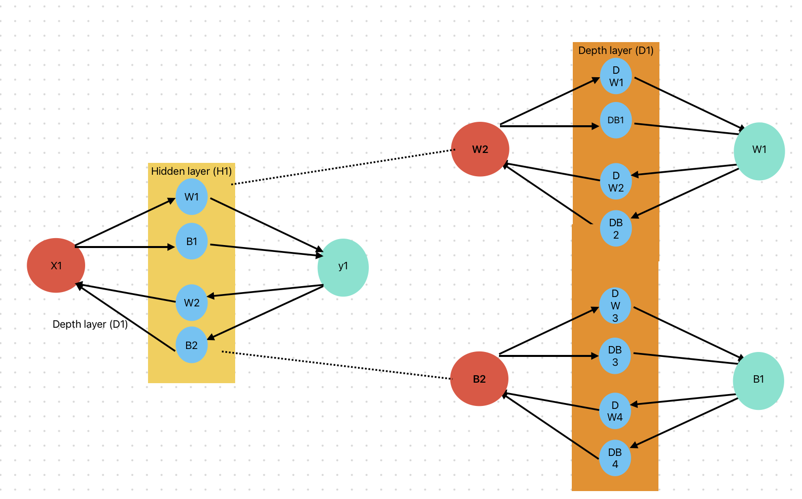
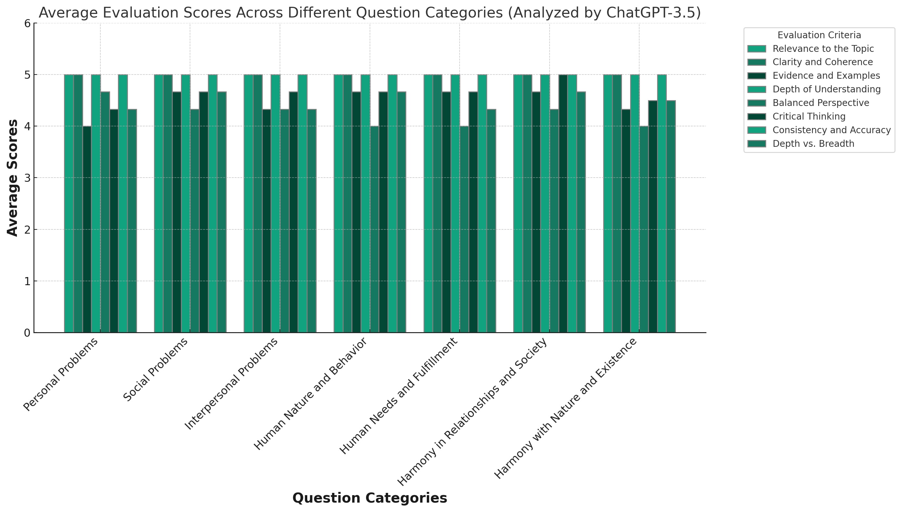
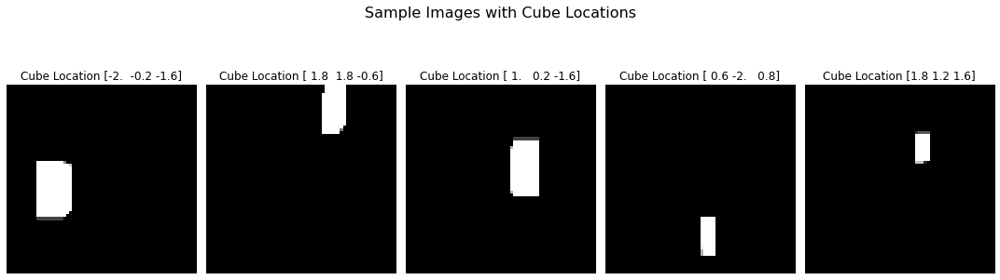
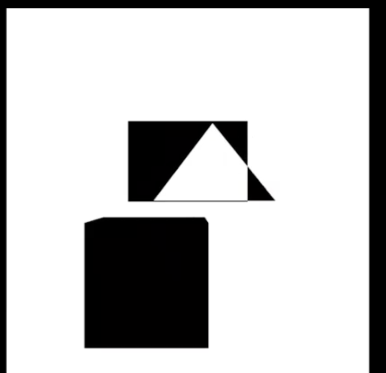

# Portfolio

### Summary:
Motivated and experienced Software Developer (4+ years) with a Master of Science in Computer Science from Portland State University. Proficient in a wide range of programming languages including Python, C#, and Java, with expertise in developing innovative solutions using machine learning, computer vision, and game development technologies. Strong background in project development, mentorship, and collaboration.

---

### Technical Skills:
- **Languages:** Python, C#, HTML, CSS, PHP, JavaScript, Java.
- **Databases:** MySQL, PostgreSQL, MongoDB.
- **Tools and Frameworks:** Android Studio, Xcode, GitHub, Git, GitLab, Laravel, Unity - Game Engine, Tensorflow, PyTorch.

---

### Projects:

  

#### [Enhanced Epoch Performance With Depth Layer](https://github.com/arpanraj/Enhanced-Epoch-Performance-With-Depth-Layers)

- Developed a depth layer between hidden layers within a neural network architecture for a linear
regression problem in Python, resulting in an overall improvement of 100 times in accuracy for the test set per epoch.

  

#### [Coexistence Guide GPT](https://github.com/arpanraj/Coexistance-Guide-GPT)
- A ChatGPT (LLM) application addressing personal, social, and interpersonal challenges, aligning with
the Coexistence Philosophy, resulting in 50+ conversations in 9 days.
- Compiled and evaluated a 21-question dataset on 9 topics with 3 difficulty levels, employing 8
criteria, including relevance and critical thinking, to assess response quality.

  

#### [3D Object Position Identification From Image](https://github.com/arpanraj/Position-Identification-from-photo)
- Generated an extensive dataset comprising 8,000 images to facilitate the localization of
three-dimensional objects, utilizing C# in conjunction with the Unity - game engine.
- Developed and assessed a Convolutional Neural Network model using TensorFlow in Python, achieving 95% accuracy on image classification tasks with 64x64 pixel input dimensions.

#### [Synthetic Image Generator: Generative Adversarial Network](https://github.com/arpanraj/GAN---Computer-Vision-and-Deep-Learning-) 
- Developed and trained a generative subnetwork model in Python using TensorFlow to generate synthetic images, tailored for the FashionMNIST dataset containing 60,000 images with dimensions of
28x28 pixels.
- Enhanced the model's capabilities through the implementation of a CNN-based GAN, resulting in the
generation of high-quality, clear, and recognizable images with minimal noise.
- Achieved grade A for the associated coursework.

  

#### [Sentiment Detection: Natural Language Processing](https://github.com/arpanraj/Sarcasm-Detection-Natural-Language-Processing)
- Implemented machine learning models in Python (Naive Bayes and Logistic Regression) for sarcasm detection in 26,709 article headlines.
- Achieved 80% accuracy with Logistic Regression, a 9% improvement over Naive Bayes and grade A for
the associated coursework.

  

#### [Sect - Puzzle Game](https://github.com/arpanraj/sect-Unity-game)
- Developed a 3d puzzle game where intersection gives opposite color to figure out destination shape in C# and Unity - Game engine, resulting in 100 plus downloads.

---

### Education:
**Master of Science, Computer Science (March 2022 – December 2023)** Portland State University, Portland, USA. GPA : 3.82

**Bachlor of Engineering, Computer Engineering (July 2013 – June 2017)**  
Gujarat Technological University, Gujarat, India.

---

### Experience:

#### Student Mentor, Portland State University (July 2022 - December 2023)
- Provided support and guidance to students over six terms, addressing various issues and queries related to adjusting to life and immigration in the USA, ultimately earning recognition as a finalist for the Portland State University Student Employee Rising Star Award.

#### Software Developer, Viitorcloud Technologies Pvt. Ltd, India (July 2017 – January 2022)
- Developed an interactive sanitization demonstration with intuitive controls in Unity - game engine
and C#
    - Presented in front of the prime minister of India at Indian Expo.
    - Garnered substantial television coverage, amassing over 100,000 views.
    - Played a pivotal role in securing endorsement for future virtual reality initiatives.
- Crafted and implemented an AI model for a project management solution using TensorFlow, Flask, AWS, and Python's machine learning libraries.
    - Wazir, a project management solution utilized by 5 companies and 1400+ developers and managers.
    - Resulted in an 11% increase in productivity for over 150 scrum masters, showcasing the effectiveness of the AI solution.
- Developed Python API for 10 types of sensor nodes such as smart water meters and smart waste management systems for a smart building management solution.
    - Smart building automation solution used across 100+ locations.
    - Ensured real-time data collection and swift response to anomalies at scale.
- Engineered computer vision models to count people using TensorFlow, OpenCV and Keras in Python for security and surveillance prototype.
- Developed a Python algorithm to detect the most dominant color in frame of continuous video and seamlessly communicated the result to Arduino for dynamic LED light display.

---

### Previous Projects:

#### Abscond - 3rd Person Shooting Game 
- Developed third person controller mechanism, input controller, 3d models and A star search algorithm in enemies AI to catch the detected player in C# using Unity - game engine, resulting in
project selection for yearly state level project demonstration.

#### World Speed Shopping - E-commerce Site (Laravel, PHP, HTML, CSS) 
- Developed Laravel-based e-commerce platform with secure authentication and PayUMoney integration, facilitating secure and efficient online transactions for physical goods.

#### Tablegroups - Social Network (Laravel, PHP, JavaScript, HTML, CSS) 
- Designed and developed Laravel-based social network with authentication, notifications, and
relationship modules, fostering community engagement among students.

#### E-doctor - Healthcare Application (Java, Android Studio) 
- Designed and implemented Java-based healthcare application with secure sign-up, login, recommendation, and search functionalities, providing doctors and patients with a convenient
platform for accessing healthcare services.

#### Farm ERP Web Application (Yii2.0, PHP, HTML, CSS, JavaScript)
- Developed Yii2.0 PHP-based ERP system with modules for livestock management and natural activity
cycles, enhancing farm and dairy management capabilities for efficient operations.

---
Feel free to reach out to discuss collaboration opportunities or for further details on any projects or experiences. Looking forward to connecting! [LinkedIn](https://www.linkedin.com/in/arpanrajpurohit/)
